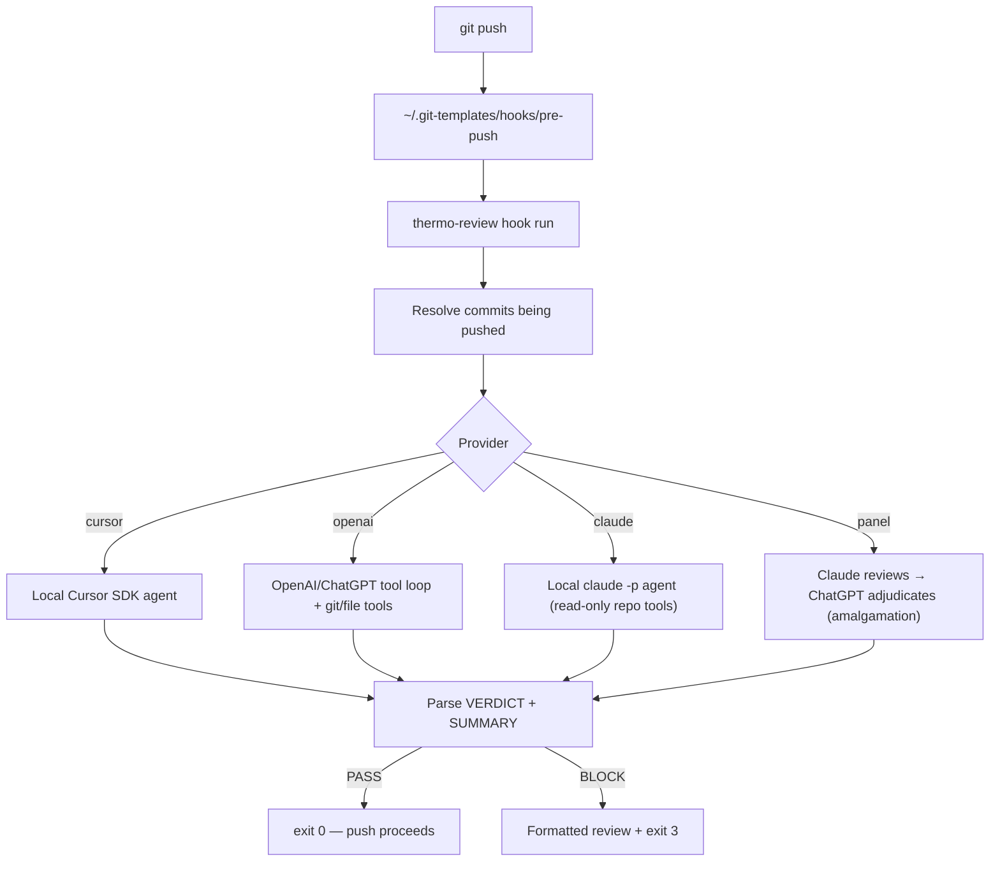

# thermo-review

**Pre-push code quality gate** that runs the [thermo-nuclear code quality review](https://github.com/cursor/cursor-team-kit) skill before every `git push`. If the review fails, push is blocked and you get a formatted block to paste back into your agent.

**Default auth is ChatGPT OAuth** — the OpenAI backend signs in with your ChatGPT account via `thermo-review login` (no OpenAI API key). The official API and Cursor SDK are opt-in alternatives.

It runs through one of several interchangeable backends:

| Provider | Runtime | Auth |
|----------|---------|------|
| `openai` (default) | OpenAI/ChatGPT tool loop + sandboxed git/file tools | ChatGPT OAuth (`thermo-review login`); official API opt-in |
| `claude` | local [`claude -p`](https://docs.claude.com/en/docs/claude-code/overview) agent with read-only repo tools | Claude Code sign-in (`claude` / `claude setup-token`) |
| `cursor` | [Cursor SDK](https://cursor.com/docs/sdk/typescript) local agent | `CURSOR_API_KEY` |
| `panel` | **amalgamation** — Claude reviews first, ChatGPT independently adjudicates its findings into one verdict | both Claude + OpenAI auth |

```text
git push
  → thermo-review runs locally via the selected backend
  → VERDICT: PASS  → push continues
  → VERDICT: BLOCK → push blocked, copy review into your agent
```

Pick the backend with `--provider`, the `THERMO_REVIEW_PROVIDER` env var, or the config file (see [Providers](#providers)). The default is `openai` using ChatGPT OAuth — run `thermo-review login` once, then plain `git push` reviews through the same repo-inspection contract as the other backends. Use `--provider claude` to review with the local Claude Code CLI, or `--provider panel` for a two-model **amalgamation** where Claude's point of view is fed to ChatGPT to adjudicate (see [Multi-model amalgamation](#multi-model-amalgamation-panel)). The background and sources behind the review structure are in [docs/review-methodologies.md](docs/review-methodologies.md).

## Why this exists

Most pre-push hooks run linters or tests. This one runs a **strict maintainability review** focused on:

- Structural regressions and missed simplification opportunities ("code judo")
- Files crossing 1,000 lines
- Spaghetti branching and feature logic leaking into shared paths
- Boundary and abstraction quality

It is intentionally harsh. Passing means the change meets the thermo-nuclear approval bar, not just "it compiles."

## How it works



The agent reviews the git diff in scope, inlines the thermo-nuclear skill instructions, and must respond with a machine-parseable verdict before the full review body. The Cursor backend uses the local agent's built-in shell/file access; the OpenAI backend is given sandboxed `git_diff` / `git_log` / `read_file` / `list_files` tools scoped to the repo root.

---

## Providers

`thermo-review` resolves the backend in this order: `--provider <name>` flag → `THERMO_REVIEW_PROVIDER` env → `~/.config/thermo-review/config.json` (`{"provider": "cursor"}`) → default `openai`.

For the OpenAI provider, auth resolves as: `THERMO_REVIEW_OPENAI_AUTH` env → config `openaiAuth` → default **`chatgpt`** (ChatGPT OAuth). Set `THERMO_REVIEW_OPENAI_AUTH=api` or `{"openaiAuth":"api"}` to use the official API instead.

### OpenAI tool loop (default)

Uses ChatGPT OAuth (`chatgpt` auth mode) with sandboxed repo tools, not an inlined/truncated diff. Sign in once, then plain `thermo-review review` or `git push` uses this transport:

```bash
thermo-review login           # opens a browser, completes OAuth on localhost:1455
thermo-review review --provider openai
thermo-review logout          # remove stored credentials
```

Credentials are cached at `~/.config/thermo-review/openai-auth.json` (mode `0600`) and refreshed automatically before expiry.

The model defaults to `gpt-5.5` (run with `medium` reasoning effort) and is overridable with `THERMO_REVIEW_OPENAI_MODEL` or the config-file `openaiModel` key. The OpenAI backend must use `git_diff`, `git_log`, `list_files`, and `read_file` before returning a verdict; oversized tool outputs return explicit errors so the model narrows scope instead of silently reviewing a prefix.

#### Official OpenAI API transport

To use the official API instead of the default ChatGPT OAuth transport, opt in with `THERMO_REVIEW_OPENAI_AUTH=api` or config `{"openaiAuth":"api"}` and provide an API key:

```bash
export OPENAI_API_KEY="sk-..."
THERMO_REVIEW_OPENAI_AUTH=api thermo-review review --provider openai
```

> ⚠️ **Known risks — experimental ChatGPT auth.**
> The default ChatGPT OAuth path uses your **ChatGPT subscription** (not OpenAI Platform API credits) by calling the same ChatGPT backend the Codex CLI uses, and it sends Codex-style `originator` / `User-Agent` headers so the backend accepts the request. OpenAI's own docs steer programmatic/automation workflows toward API keys. Driving an automated pre-push gate this way is a **gray area**: requests consume your ChatGPT plan allowance (rolling rate limits), and abuse "may result in rate limits, suspension, or termination." Use it for single-user local review only; do not pool or share tokens. The OAuth client id, endpoints, model availability, and backend request shape are reverse-engineered from Codex and **undocumented by OpenAI** — they can change without notice and break sign-in or reviews.

### Claude

Runs the review through the local Claude Code CLI in headless print mode (`claude -p`), which inspects the repo with its own file/git tools — restricted here to a **read-only allowlist** (`Read`, `Grep`, `Glob`, and read-only `git` commands), so the reviewer can read the diff, history, and surrounding files but cannot modify the repo.

```bash
claude              # sign in once (interactive), or:
claude setup-token  # long-lived token for hooks/CI
thermo-review review --provider claude
```

The model defaults to `opus` (the latest Opus — the strongest reviewer) and is overridable with `THERMO_REVIEW_CLAUDE_MODEL` (alias `opus`/`sonnet`/`haiku`, or a full model id) or the config-file `claudeModel` key. Override to `sonnet` for a faster, cheaper gate. Use a capable model: the gate's strict "verdict line first" output contract needs `opus`/`sonnet`; `haiku` is not recommended. If `claude` is not on PATH in your hook environment, set `THERMO_REVIEW_CLAUDE_BIN` to its absolute path. The run is bounded by `THERMO_REVIEW_CLAUDE_TIMEOUT_MS` (default 300000).

### Cursor

```bash
thermo-review review --provider cursor
# or: THERMO_REVIEW_PROVIDER=cursor / {"provider":"cursor"} in config.json
```

Requires `CURSOR_API_KEY` and the Cursor IDE / local agent bridge. See [setup](#full-setup-guide) below.

### Multi-model amalgamation (panel)

`--provider panel` runs **two different models** and combines them adversarially:

1. **Claude** reviews the diff first (via the `claude` backend above).
2. **ChatGPT** then reviews the same diff *independently* and **adjudicates** Claude's findings — confirming, refuting, or refining each, and adding what Claude missed — into a single amalgamated verdict.

The non-obvious part is making the second model *refine* rather than rubber-stamp the first. Naively handing model B model A's verdict triggers well-documented **sycophancy + anchoring** (a model shown a confident upstream conclusion drifts toward agreement). The panel prompt defends against this with techniques from the LLM-as-judge / ensemble literature:

- **Claude's PASS/BLOCK verdict is withheld** — ChatGPT sees only the *findings*, not the conclusion.
- **Independent-first** — ChatGPT gathers its own evidence and forms its own findings before reading Claude's.
- **Per-item CONFIRM / REFUTE / REFINE**, each tied to a concrete failure scenario, with explicit license to call false positives.
- **Neutral attribution** ("an independent first-pass reviewer") so it doesn't defer to "the other model".

The final verdict, summary, and decisions ledger all come from the ChatGPT (adjudicator) leg, so `panel` behaves like any single backend to the rest of the gate. If the Claude leg has a transient failure the panel degrades to a ChatGPT-only review (with a warning) rather than blocking your push; a Claude *setup* error (not installed / not signed in) surfaces up front. Requires both Claude sign-in and OpenAI auth.

```bash
thermo-review review --provider panel
# or: THERMO_REVIEW_PROVIDER=panel / {"provider":"panel"} in config.json
```

The methodology and primary sources behind this design are in [docs/review-methodologies.md](docs/review-methodologies.md).

---

## Full setup guide

### 1. Prerequisites

| Requirement | Notes |
|-------------|-------|
| **Node.js 22+** | `node -v` |
| **git** | Any recent version |
| **ChatGPT account** | _Default OpenAI auth_ — used via `thermo-review login` |
| **OpenAI API key** | _Optional official API auth_ — `OPENAI_API_KEY` + `THERMO_REVIEW_OPENAI_AUTH=api` |
| **Cursor IDE** | _Cursor provider only_ — with CLI / local agent bridge working |
| **Cursor API key** | _Cursor provider only_ — [Dashboard → Integrations](https://cursor.com/dashboard/integrations) |

The thermo-nuclear skill is **bundled** with the package, so no plugin install is required. If you have the **cursor-team-kit** plugin installed in Cursor, its copy is used automatically; otherwise the bundled copy is used. Override either with `THERMO_REVIEW_SKILL_PATH=/path/to/SKILL.md`.

### 2. Install thermo-review

**From source (recommended today):**

```bash
git clone https://github.com/pzep1/thermo-review-cli.git
cd thermo-review-cli
npm install
npm run build
npm link
```

Verify:

```bash
thermo-review --version
thermo-review --help
```

You should see the `review` and `hook` subcommands.

### 3. Configure provider credentials

Default OpenAI provider:

```bash
thermo-review login
```

Official OpenAI API instead:

```bash
export OPENAI_API_KEY="sk-..."
export THERMO_REVIEW_OPENAI_AUTH=api
```

Cursor provider:

```bash
export CURSOR_API_KEY="cursor_..."
```

Hooks do not always inherit your shell profile. A dedicated env file is more reliable for API-key based modes:

```bash
mkdir -p ~/.config/thermo-review
cat > ~/.config/thermo-review/env <<'EOF'
# Optional: use the official OpenAI API instead of default ChatGPT OAuth
# export OPENAI_API_KEY="sk_YOUR_KEY_HERE"
# export THERMO_REVIEW_OPENAI_AUTH=api
# export CURSOR_API_KEY="cursor_YOUR_KEY_HERE"   # only for --provider cursor
EOF
chmod 600 ~/.config/thermo-review/env
```

The pre-push hook sources this file automatically when present; ChatGPT OAuth tokens from `thermo-review login` are read from `~/.config/thermo-review/openai-auth.json`.

### 4. Install the pre-push hook

Choose based on whether you want this on **new repos only** or **all repos**.

#### New repos only

```bash
thermo-review hook install
```

Sets `git config --global init.templateDir ~/.git-templates`. Repos you `git init` after this inherit the hook.

#### All repos on this machine (most common)

```bash
thermo-review hook install --global-hooks-path
```

This also sets `git config --global core.hooksPath ~/.git-templates/hooks`, so **existing clones** use the hook too.

Confirm installation:

```bash
ls -la ~/.git-templates/hooks/pre-push
git config --global --get init.templateDir
git config --global --get core.hooksPath   # if you used --global-hooks-path
```

#### If you already have a custom pre-push hook

Global `core.hooksPath` bypasses `.git/hooks/`. Preserve your old hook by renaming it:

```bash
mv .git/hooks/pre-push .git/hooks/pre-push.local
```

After thermo-review passes, `pre-push.local` runs automatically.

### 5. Smoke test (manual review)

Before relying on the hook, run a manual review in a real repo:

```bash
cd ~/path/to/your-project
git checkout your-feature-branch
thermo-review review
```

Expected outcomes:

- **PASS** — prints `VERDICT: PASS — <summary>`, exit code 0
- **BLOCK** — prints a bordered report with "COPY BELOW INTO CURSOR AGENT", exit code 3
- **Config error** — not signed in (`thermo-review login`) or missing API key when using api auth, exit code 1 with setup instructions

Try JSON output for scripting:

```bash
thermo-review review --json
```

### 6. Smoke test (pre-push hook)

```bash
cd ~/path/to/your-project
git push
```

You should see `[thermo-review]` progress lines on stderr while the agent runs.

Escape hatches:

```bash
git push --no-verify              # skip all pre-push hooks
THERMO_REVIEW_SKIP=1 git push     # skip thermo-review only
```

---

## Daily usage

### Manual review

```bash
thermo-review review
thermo-review review --base main
thermo-review review --provider openai   # use the OpenAI backend (ChatGPT auth by default)
thermo-review review --quiet       # verdict line only
thermo-review review --json        # machine-readable
thermo-review review --skip        # no-op, exit 0
```

### Automatic on push

Every `git push` runs the review on commits being pushed:

- **Update push** — diff from remote tip to local tip
- **New branch** — diff from merge-base with `main`/`master` to HEAD

Override base branch:

```bash
thermo-review review --base develop
```

### When push is blocked

1. Read the summary and priority findings in the terminal
2. Copy the section under **COPY BELOW INTO CURSOR AGENT**
3. Paste into Cursor and fix the blockers
4. Push again: `git push`

The full report is also saved to `.git/thermo-review-last.md` in your repo for re-copy without re-running.

Example agent prompt prefix:

```text
/thermo-nuclear-code-quality-review

Fix these blockers from pre-push review on branch my-feature:
...
```

---

## Convergent feedback (tnuk ledger)

A strict reviewer is only useful if its feedback **converges**. Without memory, push 2 can suggest the opposite of push 1 ("extract this into a module" → "inline this back"), and the branch circles forever.

To prevent that, each blocked review records its **standing structural decisions** in a per-branch ledger and reads them back on every subsequent review:

- **Location** — under the repo's git dir at `thermo-review/tnuk/<branch>.md` (typically `.git/thermo-review/tnuk/`, and the correct per-worktree git dir for linked worktrees). The `<branch>` part is slugged — `/` and other non-`[A-Za-z0-9._-]` characters become `-`, and a lossy slug gets a short hash suffix so distinct branches never collide. Run `ls "$(git rev-parse --git-dir)/thermo-review/tnuk/"` to find your branch's file, then `cat` it. Local-only, never committed, never part of the reviewed diff.
- **On BLOCK** — the review emits a delimited decisions block; it is folded into the ledger along with a compact history of blocking rounds.
- **On the next review** — those decisions are injected into the prompt as **binding context**. The review must build on them and may not silently reverse a prior decision. A genuine course-correction is allowed only as an explicit, justified **reversal** on the record — so a wrong early call can still be fixed, but the feedback can't oscillate.
- **On a passing push** — the ledger is wiped automatically (the branch converged → clean slate for the next piece of work).

The manual `thermo-review review` dry run is governed by the ledger exactly like a push — it reads prior decisions as binding context and records new ones on BLOCK. Only a real passing push wipes it.

Disable the ledger entirely with `THERMO_REVIEW_NO_TNUK=1`. The ledger is an aid, never a gate: if reading or writing it ever fails, the review proceeds and the verdict is unaffected.

---

## Verdict contract

The agent must start its response with exactly:

```text
VERDICT: PASS|BLOCK
SUMMARY: <one sentence, max 120 chars>
```

Then the full review. If these lines are missing, the hook **fails closed** (BLOCK).

### Exit codes

| Code | Meaning |
|------|---------|
| `0` | PASS — push allowed |
| `1` | SDK/client startup or config error (check ChatGPT login or API-key auth mode) |
| `2` | Agent run error |
| `3` | BLOCK — push blocked |

---

## Troubleshooting

### `OPENAI_API_KEY not set`

This only applies when you opt into official API auth with `THERMO_REVIEW_OPENAI_AUTH=api` or config `{"openaiAuth":"api"}`. Create `~/.config/thermo-review/env` (see step 3) or export `OPENAI_API_KEY` in your shell.

### `CURSOR_API_KEY not set`

Only needed for `--provider cursor`. Create `~/.config/thermo-review/env` (see step 3) or export the variable in your shell.

### `Thermo-nuclear skill not found`

A copy of the skill ships with the package, so this should be rare. If you set `THERMO_REVIEW_SKILL_PATH` or a config `skillPath`, make sure it points at a readable `SKILL.md`. Resolution order: `THERMO_REVIEW_SKILL_PATH` → config `skillPath` → Cursor plugin cache → bundled copy.

### Claude provider: CLI not found or not signed in

`--provider claude` (and `panel`) shell out to the Claude Code CLI. If you see "Claude CLI not found on PATH", install [Claude Code](https://docs.claude.com/en/docs/claude-code/overview) and ensure `claude` is on PATH, or set `THERMO_REVIEW_CLAUDE_BIN` to its absolute path (hooks don't always inherit your shell PATH). If reviews fail with an auth error, sign in with `claude` once, or create a long-lived token for hooks/CI with `claude setup-token`. The default `opus` (or `sonnet`) follows the strict "verdict line first" contract; `haiku` is too weak for it, so don't override the model to `haiku`.

### OpenAI provider: `Not signed in to OpenAI`

The default OpenAI auth mode uses ChatGPT OAuth. Run `thermo-review login` to complete the experimental Sign in with ChatGPT flow. If the browser does not open, copy the printed URL manually. The callback listens on `localhost:1455` (falls back to `1457`) — make sure that port is free and not blocked by a firewall. If reviews start failing with auth errors after working before, run `thermo-review login` again (the OAuth client and backend are undocumented and can change).

### `command not found: thermo-review`

Run `npm link` from the cloned repo, or add the project's `dist/cli.js` to your PATH.

### Hook does not run on push

Check global git config:

```bash
git config --global core.hooksPath
cat ~/.git-templates/hooks/pre-push
```

Ensure `thermo-review` is on PATH in non-interactive shells (npm link usually handles this).

### Hook runs but push is slow

A full agent review takes as long as one agent turn (often 1–5+ minutes), on either backend. This is expected. Use `THERMO_REVIEW_SKIP=1` or `--no-verify` when you need an emergency push.

### `Repository has no commits yet`

Make at least one commit before running review.

### Cursor provider: SDK startup failed

- Confirm Cursor is installed and the local agent bridge works
- Verify API key at [cursor.com/dashboard/integrations](https://cursor.com/dashboard/integrations)
- Try `thermo-review review` manually and read the full error on stderr

---

## Uninstall

```bash
thermo-review logout              # remove stored OpenAI credentials (if used)
thermo-review hook uninstall
npm unlink -g thermo-review-cli
rm -rf ~/.config/thermo-review    # optional, removes API key + OpenAI auth files
```

---

## Development

See [CONTRIBUTING.md](CONTRIBUTING.md).

```bash
git clone https://github.com/pzep1/thermo-review-cli.git
cd thermo-review-cli
npm install
npm run dev    # watch mode
```

### Project layout

```text
src/
  cli.ts                       Commander entrypoint (review, login, logout, hook)
  config.ts                    Provider/key/skill resolution + config file
  types.ts                     Shared types (ProviderId, ReviewScope, …)
  review/
    run.ts                     Orchestrator: skill → prompt → backend → parse → format
    backend.ts                 ReviewBackend interface + BackendError
    provider.ts                Backend selection (lazy-imports the chosen backend)
    backends/cursor.ts                  Cursor SDK runner
    backends/openai.ts                  OpenAI backend orchestration + evidence gate
    backends/openai-transport.ts        Shared OpenAI transport contract
    backends/openai-api-transport.ts    Official OpenAI API adapter
    backends/chatgpt-codex-transport.ts Experimental ChatGPT/Codex adapter
    backends/claude.ts                  Claude backend: claude -p CLI runner (read-only tools)
    backends/panel.ts                   Panel backend: Claude → ChatGPT amalgamation
    amalgamate.ts              Anti-rubber-stamping adjudication prompt builder (shared)
    tools.ts                            Typed sandboxed git/file tools + evidence tracker
    prompt.ts                  Review prompt builder (shared)
    parse-verdict.ts           VERDICT/SUMMARY parser (shared)
    format-blocked.ts          Terminal output formatter (shared)
  auth/
    openai-oauth.ts            Sign in with ChatGPT PKCE flow
    token-store.ts             Credential storage + refresh
    jwt.ts                     id_token claim decoding
    openai-endpoints.ts        Experimental ChatGPT OAuth constants
    openai-private-backend.ts  Narrow ChatGPT/Codex compatibility layer
  git/push-scope.ts            Pre-push diff scope
  hook/install.ts              Hook install/uninstall
templates/hooks/pre-push       Shell hook template
templates/skills/thermo-nuclear/SKILL.md   Bundled review skill
```

---

## License

[MIT](LICENSE)

## Acknowledgments

- Review rubric from [cursor-team-kit](https://github.com/cursor/cursor-team-kit) thermo-nuclear skill
- Built with [@cursor/sdk](https://cursor.com/docs/sdk/typescript), the OpenAI Responses API, and the [Claude Code CLI](https://docs.claude.com/en/docs/claude-code/overview)
- Experimental "Sign in with ChatGPT" OAuth flow modeled on the [OpenAI Codex CLI](https://developers.openai.com/codex/auth)
- Multi-model amalgamation design and sources documented in [docs/review-methodologies.md](docs/review-methodologies.md)
