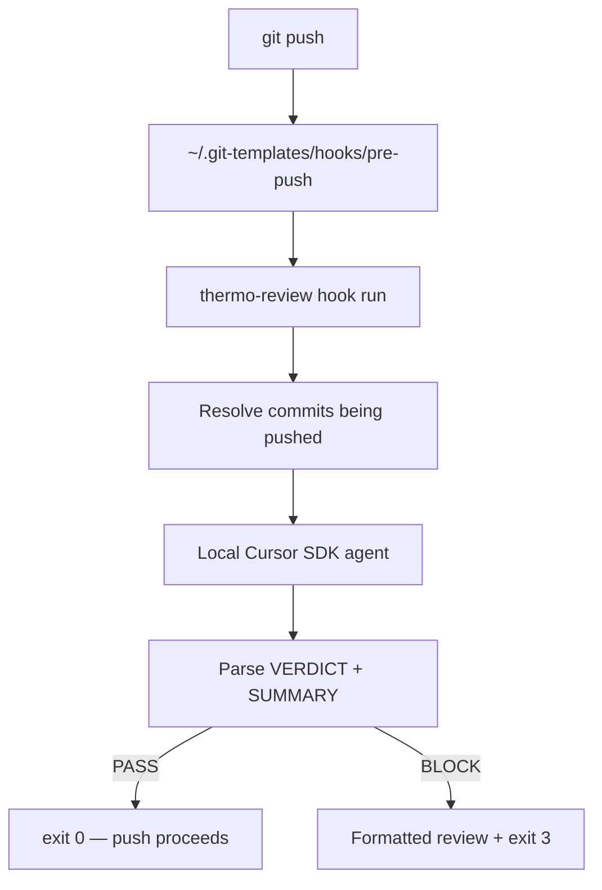

# thermo-review

**Pre-push code quality gate** powered by the [Cursor SDK](https://cursor.com/docs/sdk/typescript). Runs the [thermo-nuclear code quality review](https://github.com/cursor/cursor-team-kit) skill before every `git push`. If the review fails, push is blocked and you get a formatted block to paste back into Cursor.

```text
git push
  → thermo-review runs locally via Cursor SDK
  → VERDICT: PASS  → push continues
  → VERDICT: BLOCK → push blocked, copy review into agent
```

## Why this exists

Most pre-push hooks run linters or tests. This one runs a **strict maintainability review** focused on:

- Structural regressions and missed simplification opportunities ("code judo")
- Files crossing 1,000 lines
- Spaghetti branching and feature logic leaking into shared paths
- Boundary and abstraction quality

It is intentionally harsh. Passing means the change meets the thermo-nuclear approval bar, not just "it compiles."

## How it works



The agent reviews the git diff in scope, inlines the thermo-nuclear skill instructions, and must respond with a machine-parseable verdict before the full review body.

---

## Full setup guide

### 1. Prerequisites

| Requirement | Notes |
|-------------|-------|
| **Node.js 20+** | `node -v` |
| **git** | Any recent version |
| **Cursor IDE** | With CLI / local agent bridge working |
| **Cursor API key** | [Dashboard → Integrations](https://cursor.com/dashboard/integrations) |
| **cursor-team-kit plugin** | Provides the thermo-nuclear skill in Cursor |

Install the plugin in Cursor if you have not already:

1. Open Cursor Settings → Plugins (or Marketplace)
2. Install **cursor-team-kit**
3. Confirm the skill exists at:
   `~/.cursor/plugins/cache/cursor-public/cursor-team-kit/.../thermo-nuclear-code-quality-review/SKILL.md`

### 2. Install tnuk

**From npm (recommended):**

```bash
npm install -g tnuk.dev
```

This installs both `tnuk` and `thermo-review` on your PATH.

**From source:**

```bash
git clone https://github.com/ZNZ-systems/tnuk.dev.git
cd tnuk.dev
npm install
npm run build
npm link
```

Verify:

```bash
thermo-review --version
thermo-review --help
```

You should see the `review` and `hook` subcommands.

### 3. Configure your API key

The pre-push hook needs `CURSOR_API_KEY`. Pick one method.

#### Option A — shell profile (simple)

Add to `~/.zshrc` or `~/.bashrc`:

```bash
export CURSOR_API_KEY="cursor_..."
```

Reload your shell: `source ~/.zshrc`

#### Option B — config file (recommended for hooks)

Hooks do not always inherit your shell profile. A dedicated config file is more reliable:

```bash
mkdir -p ~/.config/thermo-review
```

Create `~/.config/thermo-review/env`:

```bash
export CURSOR_API_KEY="cursor_YOUR_KEY_HERE"
```

Lock down permissions:

```bash
chmod 600 ~/.config/thermo-review/env
```

The pre-push hook sources this file automatically when present.

> **Tip:** If your editor says "Parent dirs don't exist", run `mkdir -p ~/.config/thermo-review` first, then create the file.

Test that the key is visible:

```bash
source ~/.config/thermo-review/env
echo "${CURSOR_API_KEY:0:12}..."   # should print cursor_... prefix only
```

### 4. Install the pre-push hook

Choose based on whether you want this on **new repos only** or **all repos**.

#### New repos only

```bash
thermo-review hook install
```

Sets `git config --global init.templateDir ~/.git-templates`. Repos you `git init` after this inherit the hook.

#### All repos on this machine (most common)

```bash
thermo-review hook install --global-hooks-path
```

This also sets `git config --global core.hooksPath ~/.git-templates/hooks`, so **existing clones** use the hook too.

Confirm installation:

```bash
ls -la ~/.git-templates/hooks/pre-push
git config --global --get init.templateDir
git config --global --get core.hooksPath   # if you used --global-hooks-path
```

#### If you already have a custom pre-push hook

Global `core.hooksPath` bypasses `.git/hooks/`. Preserve your old hook by renaming it:

```bash
mv .git/hooks/pre-push .git/hooks/pre-push.local
```

After thermo-review passes, `pre-push.local` runs automatically.

### 5. Smoke test (manual review)

Before relying on the hook, run a manual review in a real repo:

```bash
cd ~/path/to/your-project
git checkout your-feature-branch
thermo-review review
```

Expected outcomes:

- **PASS** — prints `VERDICT: PASS — <summary>`, exit code 0
- **BLOCK** — prints a bordered report with "COPY BELOW INTO CURSOR AGENT", exit code 3
- **Config error** — missing API key, exit code 1 with setup instructions

Try JSON output for scripting:

```bash
thermo-review review --json
```

### 6. Smoke test (pre-push hook)

```bash
cd ~/path/to/your-project
git push
```

You should see `[thermo-review]` progress lines on stderr while the agent runs.

Escape hatches:

```bash
git push --no-verify              # skip all pre-push hooks
THERMO_REVIEW_SKIP=1 git push     # skip thermo-review only
```

---

## Daily usage

### Manual review

```bash
thermo-review review
thermo-review review --base main
thermo-review review --quiet       # verdict line only
thermo-review review --json        # machine-readable
thermo-review review --skip        # no-op, exit 0
```

### Automatic on push

Every `git push` runs the review on commits being pushed:

- **Update push** — diff from remote tip to local tip
- **New branch** — diff from merge-base with `main`/`master` to HEAD

Override base branch:

```bash
thermo-review review --base develop
```

### When push is blocked

1. Read the summary and priority findings in the terminal
2. Copy the section under **COPY BELOW INTO CURSOR AGENT**
3. Paste into Cursor and fix the blockers
4. Push again: `git push`

The full report is also saved to `.git/thermo-review-last.md` in your repo for re-copy without re-running.

Example agent prompt prefix:

```text
/thermo-nuclear-code-quality-review

Fix these blockers from pre-push review on branch my-feature:
...
```

---

## Verdict contract

The agent must start its response with exactly:

```text
VERDICT: PASS|BLOCK
SUMMARY: <one sentence, max 120 chars>
```

Then the full review. If these lines are missing, the hook **fails closed** (BLOCK).

### Exit codes

| Code | Meaning |
|------|---------|
| `0` | PASS — push allowed |
| `1` | SDK startup / config error (check API key, Cursor CLI) |
| `2` | Agent run error |
| `3` | BLOCK — push blocked |

---

## Troubleshooting

### `CURSOR_API_KEY not set`

Create `~/.config/thermo-review/env` (see step 3) or export the variable in your shell.

### `Thermo-nuclear skill not found`

Install the **cursor-team-kit** plugin in Cursor. The CLI reads the skill from:

`~/.cursor/plugins/cache/cursor-public/cursor-team-kit/.../thermo-nuclear-code-quality-review/SKILL.md`

### `command not found: thermo-review`

Run `npm link` from the cloned repo, or add the project's `dist/cli.js` to your PATH.

### Hook does not run on push

Check global git config:

```bash
git config --global core.hooksPath
cat ~/.git-templates/hooks/pre-push
```

Ensure `thermo-review` is on PATH in non-interactive shells (npm link usually handles this).

### Hook runs but push is slow

Local SDK reviews take as long as a Cursor agent turn (often 1–5+ minutes). This is expected. Use `THERMO_REVIEW_SKIP=1` or `--no-verify` when you need an emergency push.

### `Repository has no commits yet`

Make at least one commit before running review.

### SDK startup failed

- Confirm Cursor is installed and the local agent bridge works
- Verify API key at [cursor.com/dashboard/integrations](https://cursor.com/dashboard/integrations)
- Try `thermo-review review` manually and read the full error on stderr

---

## Uninstall

```bash
thermo-review hook uninstall
npm unlink -g thermo-review-cli
rm -rf ~/.config/thermo-review    # optional, removes API key file
```

---

## Development

See [CONTRIBUTING.md](CONTRIBUTING.md).

```bash
git clone https://github.com/pzep1/thermo-review-cli.git
cd thermo-review-cli
npm install
npm run dev    # watch mode
```

### Project layout

```text
src/
  cli.ts                   Commander entrypoint
  config.ts                API key + skill loading
  review/
    run.ts                 Cursor SDK agent runner
    prompt.ts              Review prompt builder
    parse-verdict.ts       VERDICT/SUMMARY parser
    format-blocked.ts      Terminal output formatter
  git/push-scope.ts        Pre-push diff scope
  hook/install.ts          Hook install/uninstall
templates/hooks/pre-push   Shell hook template
```

---

## License

[MIT](LICENSE)

## Acknowledgments

- Review rubric from [cursor-team-kit](https://github.com/cursor/cursor-team-kit) thermo-nuclear skill
- Built with [@cursor/sdk](https://cursor.com/docs/sdk/typescript)
